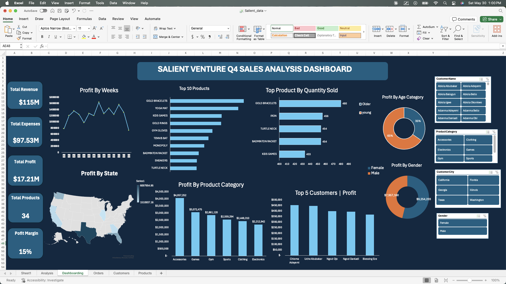

# Salient Ventures Q4 2025 Sales Analysis Dashboard (Using MS Excel)

## Overview
An interactive Excel dashboard built to analyze Q4 2025 sales performance 
for Salient Ventures — an e-commerce company that had experienced a 
consistent 20% quarter-over-quarter revenue decline across Q1–Q3 2025. 
This project validates whether the company's strategic turnaround worked.

## Business Problem
The Board of Directors needed data-backed answers before approving the 
2026 budget. The core question: was the Q4 surge in transactions 
sustainable growth or just temporary activity?

## Tools Used
- Microsoft Excel (Pivot Tables, Charts, Slicers, Dashboard)

## Dashboard Preview

  
## Dashboard Features
- Interactive slicers for City, Product Category, Customer Name, and Gender
- KPI cards for Revenue, Expenses, Profit, Profit Margin, and Total Products
- Weekly profit trend line chart
- US map showing profit by state
- Top 10 products by profit
- Profit by product category
- Top 5 customers by profit
- Top products by quantity sold
- Profit breakdown by age group and gender

- ## QUESTIONS KPIs
- Which 10 products generated the most profit
- Which product categories are the most profitable?
- What are the top 5 best-selling products by quantity sold?
- Which 5 customers contribute the highest total sales revenue?
- How does purchasing behavior differ by gender?
- Which age group of customers generates the highest sales revenue?
- What is the revenue and profit generated in the weeks in Q4
- What cities generated the most profit.

## Key Findings
- **Total Revenue:** $115M | **Total Profit:** $17.21M | **Profit Margin:** 15%
- **Texas** dominated all other states in profit generation
- **Accessories** was the most profitable product category
- **Gold Bracelets** topped both profit and quantity sold charts
- **Young customers** accounted for 65% of total profit
- **Female buyers** outspent male buyers significantly

## Conclusion
## Conclusion

The Q4 2025 analysis confirms that Salient Ventures' turnaround strategy 
was effective. Following three consecutive quarters of revenue decline, 
the company closed Q4 with $115M in revenue, $17.21M in profit, and a 
15% profit margin demonstrating measurable and sustainable recovery.

Key drivers included strong performance in Texas, high profitability 
in the Accessories and Sports categories, and significant revenue 
contribution from young and female customer segments.

The data provides sufficient evidence to support confident 2026 budget 
approval and continued investment in the strategies implemented in Q4.

